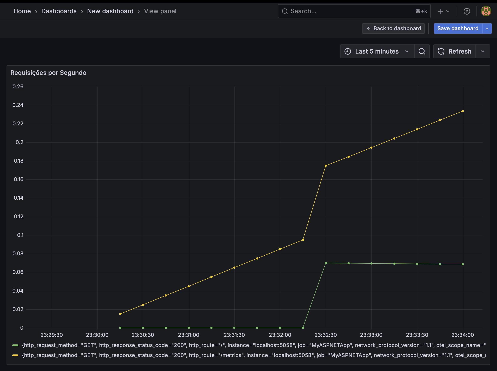

# Implementação de Métricas ASP.NET Core com Prometheus e Grafana

## Visão Geral

Este guia demonstra como implementar coleta de métricas em uma aplicação ASP.NET Core usando OpenTelemetry, Prometheus e Grafana. O fluxo de dados funciona da seguinte forma:

1. **ASP.NET Core** - Gera métricas usando OpenTelemetry
2. **Prometheus** - Coleta e armazena as métricas
3. **Grafana** - Visualiza as métricas em dashboards

## Pré-requisitos

- .NET 8.0 ou superior
- Homebrew (para macOS) ou gerenciador equivalente
- Acesso às portas: 5058 (ASP.NET), 9090 (Prometheus), 3000 (Grafana)

## Passo 1: Criando a Aplicação ASP.NET Core

### 1.1 Criar o projeto

```bash
dotnet new web -o WebMetric
cd WebMetric
```

### 1.2 Adicionar pacotes NuGet necessários

```bash
dotnet add package OpenTelemetry.Exporter.Prometheus.AspNetCore --prerelease
dotnet add package OpenTelemetry.Extensions.Hosting
```

### 1.3 Configurar Program.cs

Substitua o conteúdo de `Program.cs` pelo seguinte código:

```csharp
using OpenTelemetry.Metrics;

var builder = WebApplication.CreateBuilder(args);
builder.Services.AddOpenTelemetry()
    .WithMetrics(builder =>
    {
        builder.AddPrometheusExporter();

        builder.AddMeter("Microsoft.AspNetCore.Hosting",
                         "Microsoft.AspNetCore.Server.Kestrel");
        builder.AddView("http.server.request.duration",
            new ExplicitBucketHistogramConfiguration
            {
                Boundaries = new double[] { 0, 0.005, 0.01, 0.025, 0.05,
                       0.075, 0.1, 0.25, 0.5, 0.75, 1, 2.5, 5, 7.5, 10 }
            });
    });
var app = builder.Build();

app.MapPrometheusScrapingEndpoint();

app.MapGet("/", () => "Hello OpenTelemetry! ticks:"
                     + DateTime.Now.Ticks.ToString()[^3..]);

app.Run();
```

### 1.4 Executar a aplicação

```bash
cd WebMetric
dotnet run
```

A aplicação estará disponível em: `http://localhost:5058`

### 1.5 Verificar métricas

- Endpoint principal: `http://localhost:5058`
- Endpoint de métricas: `http://localhost:5058/metrics`

## Passo 2: Instalando e Configurando o Prometheus

### 2.1 Instalar Prometheus

```bash
brew install prometheus
```

### 2.2 Criar arquivo de configuração

Crie um arquivo `prometheus.yml` na raiz do projeto:

```yaml
# my global config
global:
  scrape_interval: 15s # Set the scrape interval to every 15 seconds. Default is every 1 minute.
  evaluation_interval: 15s # Evaluate rules every 15 seconds. The default is every 1 minute.
  # scrape_timeout is set to the global default (10s).

# Alertmanager configuration
alerting:
  alertmanagers:
    - static_configs:
        - targets:
          # - alertmanager:9093

# Load rules once and periodically evaluate them according to the global 'evaluation_interval'.
rule_files:
  # - "first_rules.yml"
  # - "second_rules.yml"

# A scrape configuration containing exactly one endpoint to scrape:
# Here it's Prometheus itself.
scrape_configs:
  # The job name is added as a label `job=<job_name>` to any timeseries scraped from this config.
  - job_name: "prometheus"

    # metrics_path defaults to '/metrics'
    # scheme defaults to 'http'.

    static_configs:
      - targets: ["localhost:9090"]

  - job_name: "MyASPNETApp"
    scrape_interval: 5s # Poll every 5 seconds for a more responsive demo.
    static_configs:
      - targets: ["localhost:5058"] # Porta onde nosso aplicativo está rodando
```

### 2.3 Iniciar Prometheus

```bash
prometheus --config.file=prometheus.yml --storage.tsdb.path=./prometheus-data --web.console.libraries=/usr/local/etc/prometheus/console_libraries --web.console.templates=/usr/local/etc/prometheus/consoles --web.enable-lifecycle &
```

### 2.4 Verificar Prometheus

- Acesse: `http://localhost:9090`
- Vá para Status → Targets para verificar se o aplicativo ASP.NET está sendo monitorado
- Consulte métricas como: `http_server_request_duration_seconds` ou `kestrel_active_connections`

## Passo 3: Instalando e Configurando o Grafana

### 3.1 Instalar Grafana

```bash
brew install grafana
```

### 3.2 Iniciar Grafana

```bash
brew services start grafana
```

### 3.3 Acessar Grafana

- URL: `http://localhost:3000`
- Login padrão: `admin` / `admin` (você será solicitado a alterar na primeira vez)

### 3.4 Configurar Data Source

1. Vá para **Configuration** → **Data Sources**
2. Clique em **Add data source**
3. Selecione **Prometheus**
4. Configure a URL: `http://localhost:9090`
5. Clique em **Save & test**

### 3.5 Criar Dashboard

1. Vá para **Create** → **Dashboard**
2. Clique em **Add new panel**
3. Configure consultas como:
   - `rate(http_server_request_duration_seconds_count[1m])` - Requisições por segundo
   - `http_server_active_requests` - Requisições ativas
   - `kestrel_active_connections` - Conexões ativas

## Passo 4: Testando e Gerando Métricas

### 4.1 Instalar dotnet-counters (opcional)

```bash
dotnet tool update -g dotnet-counters
```

### 4.2 Gerar tráfego para métricas

```bash
# Gerar várias requisições
for i in {1..20}; do
  curl -s http://localhost:5058 > /dev/null
  curl -s http://localhost:5058/metrics > /dev/null
  sleep 0.2
done
```

### 4.3 Monitorar com dotnet-counters

```bash
~/.dotnet/tools/dotnet-counters monitor -n WebMetric --counters Microsoft.AspNetCore.Hosting
```

## Estrutura do Projeto

```
metricas-asp-net/
├── WebMetric/
│   ├── Program.cs
│   ├── WebMetric.csproj
│   └── Properties/
├── prometheus.yml
├── prometheus-data/    # Criado automaticamente pelo Prometheus
└── README.md
```

## Métricas Principais Disponíveis

### ASP.NET Core Hosting

- `http_server_request_duration_seconds` - Duração das requisições HTTP
- `http_server_active_requests` - Número de requisições ativas
- `http_server_request_count` - Contador total de requisições

### Kestrel

- `kestrel_active_connections` - Conexões ativas
- `kestrel_connection_duration_seconds` - Duração das conexões
- `kestrel_queued_connections` - Conexões na fila

## URLs Importantes

- **Aplicação ASP.NET Core**: http://localhost:5058
- **Métricas da Aplicação**: http://localhost:5058/metrics
- **Prometheus**: http://localhost:9090
- **Grafana**: http://localhost:3000

## Comandos para Parar os Serviços

```bash
# Parar aplicação ASP.NET Core
# Ctrl+C no terminal onde está rodando

# Parar Prometheus
pkill prometheus

# Parar Grafana
brew services stop grafana
```

## Solução de Problemas

### Aplicação não inicia

- Verifique se a porta 5058 não está em uso
- Confirme se todos os pacotes NuGet foram instalados

### Prometheus não coleta métricas

- Verifique se o arquivo `prometheus.yml` está correto
- Confirme se a aplicação ASP.NET Core está rodando
- Verifique se o endpoint `/metrics` está acessível

### Grafana não conecta ao Prometheus

- Confirme se o Prometheus está rodando na porta 9090
- Verifique a configuração do data source no Grafana
- Use `http://localhost:9090` como URL do Prometheus

## Próximos Passos

1. **Métricas Customizadas**: Adicione suas próprias métricas usando `IMeterFactory`
2. **Alertas**: Configure alertas no Grafana ou Prometheus AlertManager
3. **Dashboards Avançados**: Importe dashboards prontos da comunidade
4. **Produção**: Configure coleta remota e persistência adequada

## Demonstração dos Gráficos em Operação

### Dashboard do Grafana - Requisições por Segundo

Abaixo está o resultado final do dashboard funcionando, mostrando as métricas de requisições por segundo em tempo real:



O gráfico demonstra:

- **Taxa de requisições HTTP por segundo** coletadas automaticamente pelo ASP.NET Core
- **Dados em tempo real** atualizados a cada 5 segundos
- **Integração completa** entre ASP.NET Core → OpenTelemetry → Prometheus → Grafana
- **Métricas precisas** showing o throughput da aplicação

### Como Reproduzir este Resultado

1. Siga todos os passos deste tutorial
2. Execute a aplicação ASP.NET Core
3. Configure o Prometheus e Grafana conforme descrito
4. Gere carga de teste com:
   ```bash
   for i in {1..50}; do
     curl -s http://localhost:5058 > /dev/null
     sleep 0.1
   done
   ```
5. Acesse o Grafana em `http://localhost:3000` e configure um panel com a query:
   ```promql
   rate(http_server_request_duration_seconds_count[1m])
   ```
